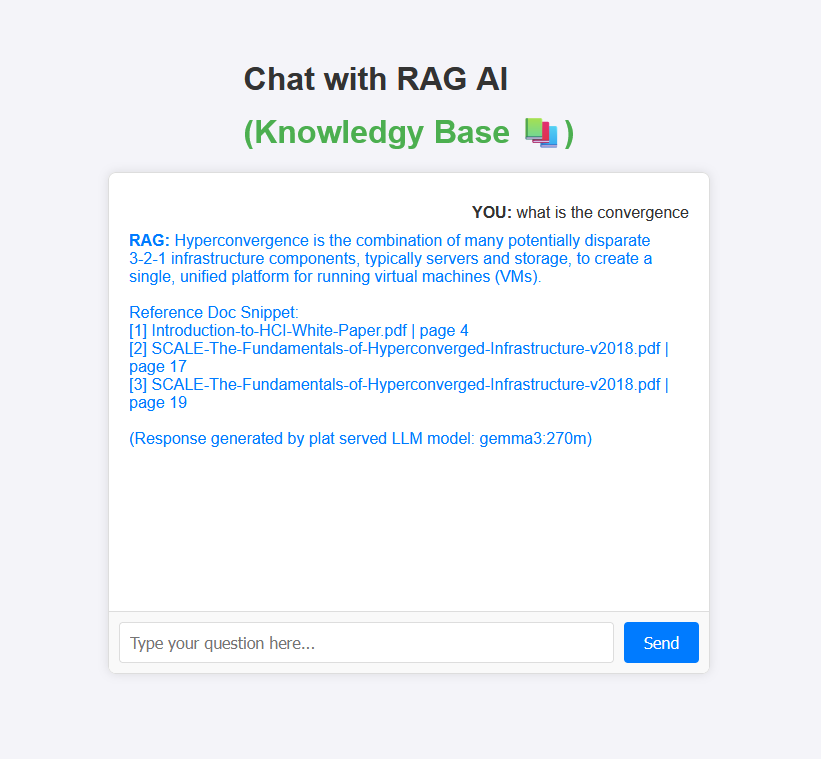
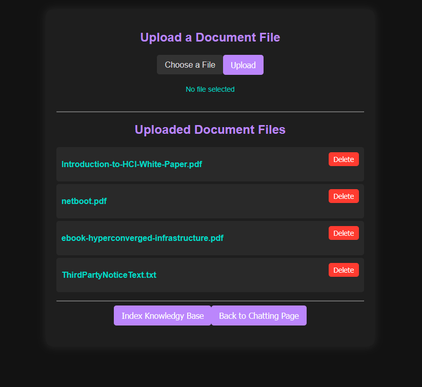

# Micro-Play: A Demo RAG Application

A demo Retrieval-Augmented Generation (RAG) application with web interface, supporting multiple AI providers and vector databases.

| Main Chat Page | Doc Admin Page |
|---------------|----------------|
|  |  |

## Features

### Core Functionality
- **Document Upload & Management**: Upload PDF, text, and code files through web interface
- **Intelligent Indexing**: Automatic document chunking and vectorization
- **Advanced Reranking**: Cross-encoder and MMR-based document reranking for better relevance
- **Multi-Provider Support**: Flexible AI model and vector database providers
- **Web Chat Interface**: Clean, responsive chat interface for Q&A

### Supported Providers

#### Embedding Models
- **Local**: Sentence Transformers (all-MiniLM-L6-v2)
- **Ollama**: Local Ollama server models
- **OpenAI**: GPT embedding models
- **Bedrock**: AWS Bedrock embeddings
- **Plat**: Served embedding models

#### LLM Models
- **Local**: Local model files
- **Ollama**: Local Ollama server models
- **OpenAI**: GPT models
- **Claude**: Anthropic Claude models
- **Plat**: Served LLM models

#### Vector Databases
- **Chroma**: Local ChromaDB
- **FAISS**: Facebook AI Similarity Search
- **Milvus**: Distributed vector database

## Quick Start

### Prerequisites
- Python 3.8+ (Note: Python 3.12+ is not supported due to FAISS library limitations)
- Docker (for Milvus vector database)
- Ollama (optional, for local models)

### Installation

1. **Clone the repository**
   ```bash
   git clone <repository-url>
   cd micro-play
   ```

2. **Create virtual environment**
   ```bash
   python -m venv .venv
   # Windows
   .venv\Scripts\activate
   # Linux/Mac
   source .venv/bin/activate
   ```

3. **Install dependencies**
   ```bash
   pip install -r requirements.txt
   ```

4. **Configure environment**
   ```bash
   cp .env.example .env
   # Edit .env with your API keys and preferences
   ```

5. **Start vector database**
   ```bash
   docker-compose up -d
   ```

6. **Run the application**
   ```bash
   python rag_web.py
   ```

7. **Open browser**
   ```
   http://localhost:8341
   ```

## Configuration

### Environment Variables

Create a `.env` file with the following variables:

```env
# Debug settings
DEBUG=True

# Supported providers
SUPPORTED_PROVIDERS=local,plat,ollama,openai,bedrock
SUPPORTED_VECTORDBS=faiss,chroma,milvus

# Embedding configuration
EMBEDDING_PROVIDER=plat
EMBEDDING_MODEL_NAME=all-minilm:latest
EMBEDDING_API_URL=http://localhost:11434
EMBEDDING_API_KEY=your_key_here

# LLM configuration
LLM_MODEL_PROVIDER=plat
LLM_MODEL_NAME=gemma3:270m
LLM_MODEL_API_URL=http://localhost:11434
LLM_MODEL_API_KEY=your_key_here

# API Keys
OPENAI_API_KEY=your_openai_key
ANTHROPIC_API_KEY=your_anthropic_key

# Vector database
VECTORDB_PROVIDER=local
VECTORDB_TYPE=milvus
VECTORDB_API_URL=http://localhost:19530
VECTORDB_API_KEY=your_key_here
VECTORDB_ROOT=.vdb

# Retrieval settings
RETRIEVAL_DOCS=9
RELEVANT_DOCS=3

# Document storage
RAW_DOC_PATH=raw_docs

# Chunking
MAX_CHUNK_SIZE=500
CHUNK_OVERLAP=50

# Reranking
RERANK_METHOD=cross_encoder
RERANK_MODEL=cross-encoder/ms-marco-MiniLM-L-6-v2
DIVERSITY_WEIGHT=0.3
RERANK_BATCH_SIZE=32

# Timeouts
OLLAMA_LLM_TIMEOUT=300
OLLAMA_EMBEDDING_TIMEOUT=120
```

## Usage

### Web Interface

1. **Chat Interface** (`/`): Ask questions about your documents
2. **Admin Panel** (`/admin`): Upload and manage documents
3. **Document Indexing**: Automatically indexes new documents

### Command Line

```bash
# Index documents
python rag_index.py

# Run chat application
python rag_app.py

# Start web server
python rag_web.py
```

### API Endpoints

- `POST /query`: Submit questions
- `POST /upload`: Upload documents
- `GET /admin`: Document management
- `POST /index_docs`: Trigger indexing

## Architecture

### Core Components

```
micro-play/
├── rag_web.py          # Flask web application
├── rag_index.py        # Document indexing
├── rag_app.py          # CLI chat application
├── config.py           # Configuration management
├── logger.py           # Logging setup
├── plat/               # Provider abstractions
│   ├── embedding/      # Embedding model factories
│   ├── llmodel/        # LLM factories
│   └── vectordb/       # Vector database factories
├── utils/              # Document processing utilities
├── rerank/             # Document reranking
├── templates/          # HTML templates
├── static/             # CSS, JS, images
└── raw_docs/           # Document storage
```

### Data Flow

1. **Document Upload**: Files uploaded via web interface
2. **Chunking**: Documents split into semantic chunks
3. **Embedding**: Chunks converted to vector representations
4. **Storage**: Vectors stored in vector database
5. **Query**: User question embedded and searched
6. **Reranking**: Results reranked for relevance
7. **Generation**: LLM generates answer using context

## Advanced Features

### Reranking Strategies

- **Cross-Encoder**: Uses transformer models for query-document relevance
- **MMR**: Balances relevance with diversity
- **Basic**: Simple similarity ranking

### Document Types Supported

- **PDF**: Extracted text with page metadata
- **Text files**: Plain text documents
- **Code files**: Programming languages with syntax awareness

### Provider Configuration

Easily switch between providers by changing environment variables:

```bash
# Switch to OpenAI
export LLM_MODEL_PROVIDER=openai
export EMBEDDING_PROVIDER=openai

# Switch to local Ollama
export LLM_MODEL_PROVIDER=ollama
export EMBEDDING_PROVIDER=ollama
```

## Development

### Running Tests

```bash
pytest
```

### Code Quality

```bash
# Format code
black .

# Lint code
flake8 .

# Type checking
mypy .
```

### Docker Development

```bash
# Build application container
docker build -t micro-play .

# Run with docker-compose
docker-compose up
```

## Troubleshooting

### Common Issues

1. **Model Loading Errors**
   - Ensure Ollama is running: `ollama serve`
   - Check model names: `ollama list`

2. **Vector Database Connection**
   - Verify Docker containers: `docker ps`
   - Check ports: `netstat -tlnp`

3. **API Key Errors**
   - Verify API keys in `.env`
   - Check provider quotas

### Logs

Application logs are stored in `logs/` directory:
- `rag_app.log`: General application logs
- `rag_app_error.log`: Error logs

## Contributing

1. Fork the repository
2. Create a feature branch
3. Make your changes
4. Add tests
5. Submit a pull request

## License

[Your License Here]

## Support

For support and questions:
- Create an issue on GitHub
- Check the documentation
- Review the logs for error details
